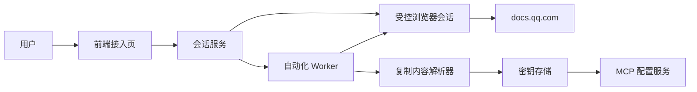
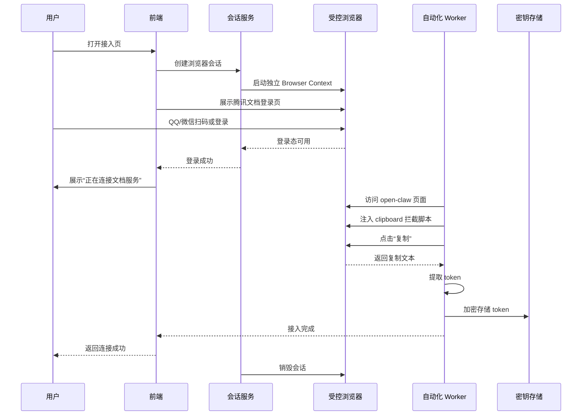

# 腾讯文档隐藏式 Token 获取方案

## 目标

为用户提供一个尽量无感的腾讯文档接入流程：

- 用户只看到登录动作
- 登录成功后，不再向用户展示腾讯文档页面内部操作
- 系统在后台自动进入腾讯文档 `open-claw` 页面
- 自动点击“复制”拿到真实 MCP token
- 自动完成 token 提取、校验、加密存储和后续配置

## 结论

这个方案可以做，但前提不是“把微信 token 透传给腾讯文档”，而是：

- 用户必须在一个受控浏览器会话里直接完成 `docs.qq.com` 登录
- 登录后的 token 获取动作必须发生在同一个浏览器会话里
- 后台自动化依赖腾讯文档现有页面结构和复制逻辑，属于脆弱集成

## 非目标

- 不尝试绕过腾讯文档登录
- 不尝试伪造 `docs.qq.com` 会话 cookie
- 不尝试把第三方微信登录 token 直接变成腾讯文档登录态
- 不改造腾讯文档前端逻辑，只做浏览器层自动化

## 关键判断

### 1. 为什么不能做“微信 token 透传”

腾讯文档页面依赖的是 `docs.qq.com` 自己的登录会话，而不是你站点持有的微信 token。

这意味着：

- 你的前端无法给 `docs.qq.com` 设置有效登录 cookie
- `docs.qq.com` 的会话 cookie 通常是 `HttpOnly`，前端脚本拿不到
- 页面上的 MCP token 是登录后动态渲染和复制出来的，不在公开 HTML 中

### 2. 为什么“同一浏览器会话后台自动化”可行

只要用户是在你控制的浏览器会话里完成腾讯文档登录，后续操作就都可以继续沿用这个会话状态：

1. 访问 `https://docs.qq.com/scenario/open-claw.html?nlc=1`
2. 等待页面渲染出“复制”按钮
3. 触发复制动作
4. 截获真实复制内容
5. 提取 token

## 总体架构



## 时序



## 核心组件

### 1. 前端接入页

职责：

- 发起接入流程
- 承载远程浏览器画面或 WebView
- 在用户登录成功后隐藏浏览器画面
- 展示连接进度和最终状态

要求：

- 登录成功后不要再继续暴露腾讯文档内部页面
- 不显示 token 原文
- 不显示复制得到的命令或明文凭证

### 2. 会话服务

职责：

- 为每个用户创建独立浏览器上下文
- 维护会话生命周期
- 为 Worker 提供会话句柄
- 在流程结束后销毁上下文

要求：

- 每个用户必须独立 Context，不能复用 cookie jar
- 会话超时自动清理
- 浏览器 crash 后可恢复或重新发起

### 3. 自动化 Worker

职责：

- 检测登录成功
- 导航到 `open-claw` 页面
- 注入拦截脚本
- 自动点击“复制”
- 提取并验证 token

要求：

- 所有页面选择器都要带兜底逻辑
- 对页面改版保持基本容错
- 所有日志默认脱敏

### 4. 复制内容解析器

职责：

- 解析“完整安装命令”里的 `TENCENT_DOCS_TOKEN`
- 解析“token 复制”按钮返回的裸 token
- 输出统一结构给后续存储层

统一输出示例：

```json
{
  "token": "<secret>",
  "source": "copy_install_command",
  "captured_at": "2026-05-07T15:30:00+08:00"
}
```

### 5. 密钥存储

职责：

- 加密保存 token
- 关联用户、租户、空间、接入状态
- 支持重置和轮换

要求：

- 明文 token 不入日志
- 数据库存储前加密
- 管理后台默认不显示完整 token

## 关键实现

### 1. 不依赖系统剪贴板

最稳的做法不是去读操作系统剪贴板，而是在页面加载前拦截：

```js
await page.addInitScript(() => {
  const copied = [];
  window.__capturedCopies = copied;

  const originalWriteText = navigator.clipboard.writeText.bind(navigator.clipboard);
  navigator.clipboard.writeText = async (text) => {
    copied.push(text);
    window.__lastCopiedText = text;
    return originalWriteText(text);
  };
});
```

后台点击“复制”后，再读取：

```js
const copiedText = await page.evaluate(() => window.__lastCopiedText || "");
```

优势：

- 不依赖宿主机剪贴板权限
- 不污染用户本机剪贴板
- 更容易做脱敏和审计

### 2. 登录成功判定

可以组合以下信号判断：

- 页面顶部出现头像，而不是“登录腾讯文档”按钮
- `open-claw` 页面出现“复制”按钮
- 页面渲染出“龙虾原生接入流程”模块

不要只依赖单一选择器。

### 3. Token 提取策略

优先顺序：

1. 点击第 3 条 token 区域的“复制”按钮，直接拿裸 token
2. 如果失败，点击第 1 条安装指令的“复制”按钮，再从整段文本中提取

提取正则示例：

```regex
TENCENT_DOCS_TOKEN="([^"]+)"
```

### 4. Token 校验

拿到 token 后，不要直接认为成功，至少做一次轻量验证。

建议校验方式：

- 用 token 请求腾讯文档 MCP 工具列表
- 或调用一个低成本只读能力，如最近文件列表

成功后再写入正式密钥库。

## 推荐流程

### Phase 1: POC

- 单用户串行接入
- Playwright 独立浏览器会话
- 登录后自动隐藏页面
- 自动点击复制并提取 token
- token 加密入库

### Phase 2: 服务化

- 支持多用户并发
- 接入状态机
- 会话回收和失败重试
- 接入审计日志
- token 重置流程

### Phase 3: 稳定性增强

- DOM 变更监控
- 页面快照回放
- 失败截图和告警
- A/B 选择器策略

## 失败场景

### 1. 腾讯文档页面改版

表现：

- “复制”按钮找不到
- 登录态检测失效
- token 文本结构变化

应对：

- 保留多套选择器
- 每次失败存截图和页面快照
- 用 feature flag 切换策略

### 2. 用户登录触发风控

表现：

- 需要二次验证
- 弹出额外确认
- 登录时间过长

应对：

- 将风控步骤继续暴露给用户完成
- 后台等待同一会话继续执行

### 3. 复制逻辑变更

表现：

- `clipboard.writeText` 不再被调用
- 改成原生组件或下载动作

应对：

- 退回到读取 DOM 中的展示数据
- 退回到操作系统剪贴板兜底

### 4. Token 可用但权限不足

表现：

- 能配置成功，但调用时报 VIP 或积分错误

应对：

- 接入成功后立即调用一条最低成本业务请求
- 明确区分“token 获取成功”和“能力可用”

## 安全与合规

### 最低要求

- token 只在内存中短暂停留
- 默认日志脱敏
- 浏览器会话结束后立即销毁
- 不保存用户腾讯文档密码
- 不录屏保存完整登录过程

### 必须提醒的风险

- 这是对第三方页面的自动化操作，稳定性受对方页面控制
- 这类流程可能受服务条款、风控和业务策略影响
- token 属于高敏凭证，泄露后可直接调用对应 MCP 能力

## 建议的数据模型

```json
{
  "id": "conn_123",
  "user_id": "user_123",
  "provider": "tencent_docs",
  "status": "active",
  "space_scope": "default_or_selected",
  "token_ciphertext": "<encrypted>",
  "token_last4": "f2dc",
  "verified_at": "2026-05-07T15:35:00+08:00",
  "created_at": "2026-05-07T15:34:12+08:00",
  "updated_at": "2026-05-07T15:35:00+08:00"
}
```

## 最小接口设计

### 创建会话

```http
POST /api/tencent-docs/connect/session
```

返回：

```json
{
  "session_id": "sess_123",
  "stream_url": "wss://browser.example.com/sess_123",
  "status": "waiting_login"
}
```

### 确认登录后进入后台流程

```http
POST /api/tencent-docs/connect/session/sess_123/finalize
```

返回：

```json
{
  "status": "capturing_token"
}
```

### 查询接入状态

```http
GET /api/tencent-docs/connect/session/sess_123
```

返回：

```json
{
  "status": "active"
}
```

## MVP 判断

这个方案适合作为 POC，因为它能快速验证一件最关键的事情：

> 用户是否愿意在你的受控浏览器会话里完成登录，并接受“登录后系统自动代为完成接入”。

它不适合一开始就重投入产品化，因为稳定性和合规边界都依赖腾讯文档页面行为。

## 实施建议

先做 POC，范围控制在：

1. 受控浏览器登录
2. 后台自动进入 `open-claw`
3. 自动点击“复制”
4. 截获 token
5. 校验并加密入库

在 POC 验证通过前，不建议先做：

1. 多租户复杂权限模型
2. 大规模并发浏览器池
3. 深度品牌包装
4. 长生命周期 token 轮换系统

## 下一步

1. 用 Playwright 实现最小自动化链路
2. 接入一个简单的密钥存储
3. 做一版只支持单用户的接入页
4. 验证 3 类场景：首次登录、token 重置、权限不足
